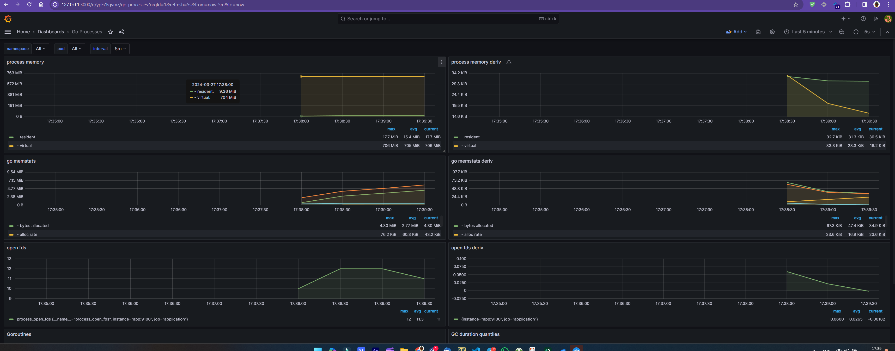

## Deployment Documentation using Docker and Kubernetes

### Docker Compose Setup

Run the following command to build containers and run them:

```bash
docker-compose up
```

After that, application will be available at http://127.0.0.1:8080/. 
Grafana will be available at http://127.0.0.1:3000/. Use `admin` as login and password to login. 
Grafana dashboard will be installed during docker-compose up action and will be located at `Dashboards/General` folder. 
Check related .
### Minikube Preparation

- Install Minikube using the official documentation.
- Enable the Ingress addon:

```bash
minikube addons enable ingress
```

### Redis Installation

Add the Bitnami repository for installing Redis:

```bash
helm repo add bitnami https://charts.bitnami.com/bitnami
```

Install Redis using Helm:

```bash
helm install redis bitnami/redis --values minikube_files/values-minikube.yml
```

### Application Installation

Install the application using Helm:

```bash
helm install devops-test ./chart/
```

This will deploy the app with version `0.0.1` to Minikube.

### Host Configuration

Add the following entry to your `/etc/hosts` file to map `127.0.0.1` to `devops-test.example.io`:

```
127.0.0.1 devops-test.example.io
```

### Ingress Controller Tunneling

Start the Ingress controller tunnel to enable access to your application:

```bash
minikube tunnel
```

The tunnel will now be available on port 80.

### Additional Tasks

- **Implement Kubernetes Monitoring:** Set up monitoring for your Kubernetes cluster, using Prometheus and Grafana.
  
- **Configure Health Checks for the Application:** Ensure proper health checks for your application, potentially utilizing the `github.com/heptiolabs/healthcheck` Go module.

- **Application Security Hardening:** Use HashiCorp Vault for storing secrets such as the Redis connection string.

- **Enhance Documentation Accuracy:** Provide detailed descriptions for each deployment step, including commands, parameters, and dependencies.

- **Use transaction tracing:** Use opentelemetry for transaction tracing and grafana tempo as viewer.
